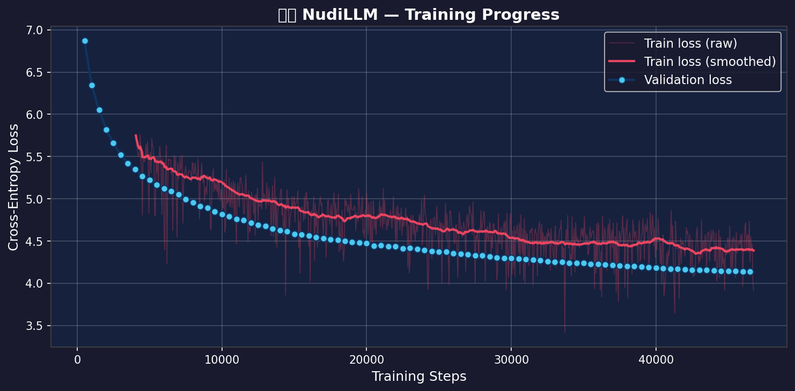

# NudiLLM — Mini Kannada Language Model

A **mini GPT-style language model** trained on Kannada text, built from scratch.
~14 million parameters, runs on a GTX 1650 (4GB VRAM).

---

## 🏗️ Architecture

| Component | Value |
|---|---|
| Model type | Decoder-only Transformer (GPT-2 style) |
| Parameters | ~14 Million |
| Layers | 6 Transformer blocks |
| Attention heads | 6 |
| Embedding dim | 384 |
| Context length | 256 tokens |
| Vocabulary | 8,000 Kannada BPE tokens |
| Training dtype | FP16 |

---

## ⚡ Quick Start

### Step 0: Install dependencies
```bash
pip install torch --index-url https://download.pytorch.org/whl/cu121
pip install -r requirements.txt
```

### Step 1: Test the model architecture
```bash
python test_model.py
```

### Step 2: Download Kannada data
```bash
python data/prepare_data.py
```

### Step 3: Train the Kannada tokenizer
```bash
python tokenizer/train_tokenizer.py
```

### Step 4: Train the model
```bash
python train.py
```

### Step 5: Web UI (ChatGPT-Style)
```bash
python app.py
```
*Open `http://localhost:5000` in your browser.*

### Step 6: Generate Kannada text (CLI)
```bash
python inference.py --prompt "ಕನ್ನಡ ಭಾಷೆ"
```

---

## 🧬 Model Versions

### NudiLLM v0 (Base Model)
Trained from scratch on raw Kannada Wikipedia text to predict the next word. It understands Kannada grammar and facts but acts like an autocomplete engine.

### NudiLLM v1 (Instruct Fine-Tuned)
Fine-tuned on a Q&A dataset (`instruct_kannada.json`) to act as a conversational assistant. Learns to wrap inputs in `<|user|>` and `<|ai|>` tokens and responds directly to questions instead of trailing off.

*To train v1 from v0:*
```bash
python finetune.py
```

---

## 📁 Project Structure

```
NudiLLM/
├── data/
│   ├── prepare_data.py       # Download Kannada Wikipedia
│   ├── raw/                  # Cached HuggingFace datasets
│   └── processed/            # Cleaned train.txt / val.txt
├── tokenizer/
│   ├── train_tokenizer.py    # Train Kannada BPE tokenizer
│   ├── kannada_bpe.model     # (generated)
│   └── tokenizer_config.json # (generated)
├── model/
│   ├── nudi.py              # Model architecture (NudiLLM class)
│   └── dataset.py            # Dataset & DataLoader
├── checkpoints/
│   ├── best.pt               # Best checkpoint by val loss
│   ├── latest.pt             # Latest checkpoint (for resuming)
│   └── final.pt              # Final trained model
├── logs/
│   ├── train_log.json        # Loss history
│   └── loss_plot.png         # Loss curve plot
├── train.py                  # Training script
├── inference.py              # Text generation
├── test_model.py             # Sanity tests
├── plot_loss.py              # Loss visualization
└── requirements.txt
```

---

## 🖥️ Hardware Requirements

| Component | Minimum | Your Setup |
|---|---|---|
| GPU | NVIDIA GTX 1050 (2GB) | GTX 1650 (4GB) ✅ |
| RAM | 8GB | - |
| Storage | 5GB free | - |
| OS | Windows/Linux | Windows ✅ |

**Estimated training time on GTX 1650:** ~2–5 hours

---

## 📊 Expected Results

After training on Kannada Wikipedia:
- **Perplexity**: ~63 (val loss ≈ 4.14 at step 46,500 → e^4.14 ≈ 63)
- **Capability**: Continues Kannada text coherently
- **Quality**: Similar to early GPT-1 (2018) for Kannada

### 📉 Training Loss Curve



---

## 🔧 Troubleshooting

**CUDA out of memory?**
```python
# In train.py, reduce batch_size to 4
"batch_size": 4,
```

**Download fails?**
Manually place any Kannada text file at `data/processed/kannada_corpus.txt`

**Slow training?**
Make sure PyTorch is using CUDA:
```python
python -c "import torch; print(torch.cuda.is_available())"
# Should print: True
```

---

## 📚 References

- [nanoGPT](https://github.com/karpathy/nanoGPT) — Andrej Karpathy's minimal GPT
- [AI4Bharat Sangraha](https://huggingface.co/datasets/ai4bharat/sangraha) — Indic datasets  
- [Cognitive-Lab Ambari](https://huggingface.co/Cognitive-Lab) — Kannada LLM reference
- [Attention Is All You Need](https://arxiv.org/abs/1706.03762) — Original Transformer paper
